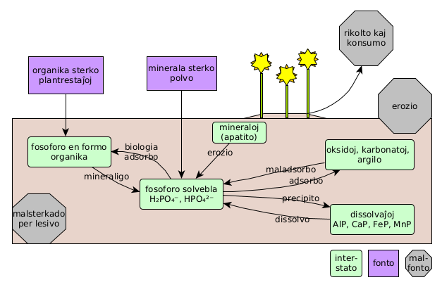

Alie ol ĉe azoto, oksigeno, karbondioksido kaj akvovaporo, la atmosfero ne ludas gravan rolon en la transportado de la vivelemento fosforo. Do oni aparte konsideras la terenojn akvajn kaj terajn fosforciklojn.

## surtera

<!-- malseka grundo... 
https://en.wikipedia.org/wiki/Eutrophication
https://de.wikipedia.org/wiki/Phosphatfalle
https://de.wikipedia.org/wiki/Umkippen

-->