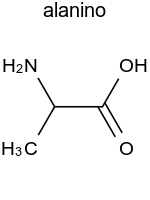
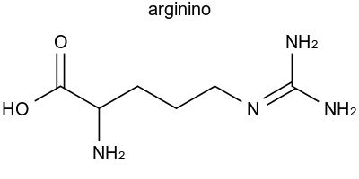
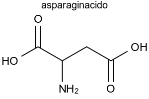

  <!-- servi mankantajn funkciojn depende de uzata retumilo -->
  
  <!-- subteno por matematikaj kaj kemiaj formuloj -->
  

Aminacidoj estas estas la bazaj konstrueroj de la [proteinoj](proteino). Ili estas rekte koditaj per la genetika 
kodo.

La sekvajn dudek oni nomas *kanonaj proteinogenoj*.

|esperanta nomo|mallongigo|unulitera|sumformulo|
|-|-|-|
|alanino|Ala|A|$$\ce{C3H7NO2}$$||
|arginino|Arg|R|$$\ce{C6H14N4O2}$$|
|asparagino|Asn|N|$$\ce{C4H8N2O3}$$|
|aspartato|Asp|D|$$\ce{C4H7NO4}$$|
|cisteino|Cys|C|$$\ce{C3H7NO2S}$$|
|glutamino|Gln|Q|$$\ce{C5H10N2O3}$$|
|glutamato|Glu|E|$$\ce{C5H9NO4}$$|
|glicino|Gly|G|$$\ce{C2H5NO2}$$|
|histidino|His|H|$$\ce{C6H9N3O2}$$|
|izoleŭcino|Ile|I|$$\ce{C6H13NO2}$$|
|leŭcino|Leu|L|$$\ce{C6H13NO2}$$|
|lizino|Lys|K|$$\ce{C6H14N2O2}$$|
|metionino|Met|M|$$\ce{C5H11NO2S }$$|
|fenilalanino|Phe|F|$$\ce{C9H11NO2}$$|
|prolino|Pro|P|$$\ce{C5H9NO2}$$|
|serino|Ser|S|$$\ce{C3H7NO3}$$|
|treonino|Thr|T|$$\ce{C4H9NO3}$$|
|triptofano|Trp|W|$$\ce{C11H12N2O2}$$|
|tirozino|Tyr|Y|$$\ce{C9H11NO3}$$|
|valino|Val|V|$$\ce{C5H11NO2}$$|

Nekonanaj proteinogenoj estas

|esperanta nomo|mallongigo|unulitera|sumformulo|
|-|-|-|
|pirolizino|Pyl|O|$$\ce{C12H21N3O3}$$|
|selenocisteino|Sec|U|$$\ce{C3H7NO2Se}$$|

