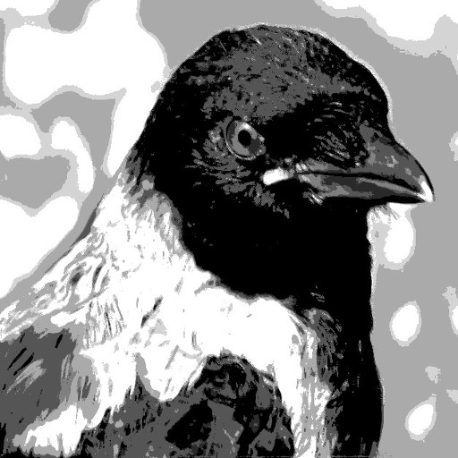

{: style="width: 100px;"}

## Celo
{: .sekcio}

- krei retpaĝojn pri baza scio de sciencoj
- precipe pri natursciencoj, kelkaj aliaj fakoj

## Karaktero
{: .sekcio}

- nivelo de gimnaziano aŭ ambicia laiko
- ne postulanta universitatan scion
- fokuso sur modeloj kaj teorioj helpantaj kompreni naturon
- flankenlasi praktikajn sciojn (realaj eksperimentoj ja ne eblas...)
- flankenlasi tro formalajn sciojn (kalkulsistemoj, k.s. krom se ili necese subtenas la fokusan enhavon)
- klarigi prefere per interagaj grafikoj anstataŭ longaj tekstoj aŭ kalkuloj
- ideale lernado similu viziton de muzeo aŭ migradon laŭ instrupado en la naturo

## Teknikaj rimedoj
{: .sekcio}

- uzo de senpagaj Github-paĝoj
- enhavo estas statikaj retpaĝoj kreitaj generitaj per Jekyll/Liquid
- baza teksto do estas en Viki-speca formato *markdown*
- tiel ne eblas servilaj programoj, do dinamika enhavo funkciu senescpete per Javoskripto
- grafikoj farataj kiel vektorgrafikoj (SVG), movataj per Javoskripto
- specialaj JS-bibliotekoj por fakoj, ekz-e JsMol por 3-dimensia prezento de molekuloj, MathJAx por matematikaj kaj kemiaj formuloj
- ideale antaŭpreparitaj JS-bibliotekoj reduktu la kodon en la enhavpaĝoj al alnotoj `{: ...}` kaj malmultaj kompreneblaj kodlinioj