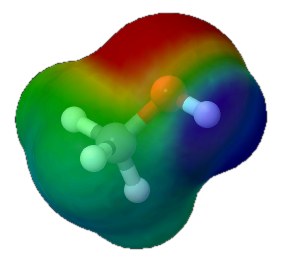

*Elektronegativeco* de elemento estas mezuro pri la kapablo de ĝiaj atomoj altiri 
ligajn elektronojn al si. Tiel du atomoj kun sama elektronegativeco formas 
egalecajn kovalentajn ligojn. Se la elektronegativeco diferencas (pli ol 0,5), la ligo ne estas egalmezura, 
t.e. *poluseca*. Sed ĉe tre granda diferenco (2.0 aŭ pli) la
ligo estas jona, ĉar elektrono komplete transiras de unu atomo al alia.[^W1]

La intervalon de 1,7 ĝis 2,0 oni foje nomas jona transiro, ĉar foje necesas pli detale esplori, ĉu tiam temas pri poluseca aŭ jona ligo.

<svg id="periodsistemo"
    version="1.1" 
    xmlns="http://www.w3.org/2000/svg" 
    xmlns:xlink="http://www.w3.org/1999/xlink" width="100%" viewBox="0 0 195 115">
</svg>

<!-- 
-9..0: ciuj e-neg, kiuj rondigite donas la entjeran valoron
0.7 .. 4 pasoj je dekono, nur ekzaktaj valoroj kalkuliĝu

-->

<label id="eneg_lbl" for="eneg_info">elektronegativeco (laŭ Paŭling):</label> <b>1</b> 
<input type="range" id="eneg_val" style="width: 100%" step="1" value="12" min="0" max="118"  onchange="aktualigo()" oninput="aktualigo_info(); aktualigo();">

## Polusecaj ligoj
{: .sekcio}

Se ni rigardas ekzemple molekulon de metanolo ni ricevas la sekvajn diferencojn
por la unuopaj ligoj:

$$\ce{C-H}: 2,55-2,20 = 0,35$$  
$$\ce{C-O}: 3,44-2,55 = 0,89$$  
$$\ce{O-H}: 3,44-2,20 = 1,24$$  

Ĉiuj do estas kovalentaj, sed oksigeno pro sia alta elektronegativeco pli forte altiras la elektronojn de la hidrogena kaj karbona ligantoj. Tiel estiĝas poluseca ligo kiu rezultas en negativa parta ŝargo ĉe la oksigenatomo kaj pozitiva parta ŝargo ĉe la najbara hidrogenatomo.

<!--  -->

elektrostatika potencialo de metanolo

<!-- lig-preferoj...
https://en.wikipedia.org/wiki/Periodic_table#Metallicity
-->

<!-- montro de elektrostatika potencialo...:
https://chemapps.stolaf.edu/jmol/docs/examples-11/surfacedemos.htm
https://chemapps.stolaf.edu/jmol/docs/examples-11/isosurface.htm
https://wiki.jmol.org/index.php/File_formats/Surfaces
https://www.poissonboltzmann.org/

# konvertado...
http://biochemlabsolutions.com/Molecule%20Docking/FORMATS/Formats%20PDB%20PDBQT%20SDF%20MOL.html

superrigardon pri tiu kaj alia konceptoj donas la prezentaĵo:
https://www.csus.edu/indiv/s/spencej/chem%2031%20summer%2014%20web/day%202%20lecture.pdf

-->

<h2></h2>
[intermolekulaj fortoj](intermolekulaj_fortoj){: .sekva_folio}

## fontoj
{: .fontoj}

[^W1]: [(en) Intermolecular Forces: Review Electronegativity](https://www2.chem.wisc.edu/deptfiles/genchem/netorial/rottosen/tutorial/modules/intermolecular_forces/01review/review4.htm)

[^W2]: [(de) Elektronegativität](https://de.wikipedia.org/wiki/Elektronegativit%C3%A4t)

<!-- 
aliaj fontoj:
https://pubchem.ncbi.nlm.nih.gov/periodic-table/#view=list
https://www.chemie.de/lexikon/Elektronegativit%C3%A4t.html#Pauling-Skala 
https://www.degruyter.com/document/doi/10.1515/ci-2020-0305/html
https://www.cup.lmu.de/ac/kluefers/homepage/L/kc2/literature/iupac_oxidation_state_2016.pdf
-->