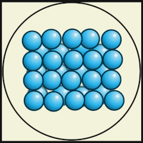
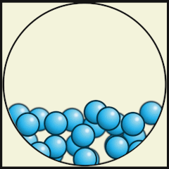
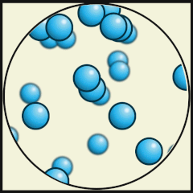

Substanco, materio, povas esti en diversaj statoj depende de fizikaj kondiĉoj kiel temperaturo kaj premo. Tiel akvo ĉe ordinara atmosfera premo inter 0°C kaj 100°C estas en *likva*, sub 0°C en *solida* (t.e. neĝo, glacio) kaj super 100°C en *gasa* stato (vaporo). Transiron de la solida al likva stato oni nomas *degelo*, de likva al gasa, *vaporiĝo*. Inverse transiro de gasa al likva nomiĝas *kondensiĝo* kaj de likva al solida, *solidiĝo*.  

Sub kiuj kondiĉoj de temperaturo kaj premo substanco transiras de unu stato al alia dependas de la fortoj inter ĝiaj eroj, do, kvankam fizika fenomeno, ĝi estas influata de la ĥemia konsisto de la substanco: 

- ĉar la fortoj inter nobelgasaj atomoj kaj malgrandaj molekuloj estas relative malgrandaj, tiaj substancoj kiel heliumo, nitrogeno aŭ oksigeno en normalaj surteraj kondiĉoj aperas kiel gasoj, kaj nur ĉe tre malaltaj temperaturoj likviĝas aŭ eĉ solidiĝas. Ekzemple oksigeno kondensiĝas ĉe −183°C kaj solidiĝas ĉe −218,3°C.
- la fortoj de metala ligo estas pli altaj, kaj tiel metaloj estas normale solidoj, kun kelkaj esceptoj, kiel hidrargo aŭ cezio kiuj estas pli malpli likvaj ĉe normala temperaturo. Metaloj kutime likviĝas nur ĉe temperaturoj de kelkcent gradoj celsiaj. Ekzemple degelas magnezio ĉe 650°C kaj vaporiĝas ĉe 1110°C.
- ankaŭ jonaj fortoj estas tre grandaj, tiel ke ekzemple natria klorido, la tabla salo, degelas je 801°C kaj vaporiĝas je 1461°C

Oni povas resumi bazajn ecojn de la tri bazaj materistatoj tiel:

- Solidaĵo: la eroj troviĝas en fiksita aranĝo aŭ regula (*kristala*) aŭ neregula (*amorfa*). Ili vibras ene de la aranĝo sed ne moviĝas libere. Solidaĵo konservas sian formon kaj ne multe ŝanĝas la volumenon sub premo.
- Likvaĵo: la eroj ne troviĝas en fiksita aranĝo sed estas tre proksimaj unu al la alia. La fortoj inter la eroj estas relative altaj, tiel ke la eroj povas rearanĝiĝi sed ne libere moviĝi. Likvaĵo adaptiĝas al ĉirkaŭa ujo sed la eroj kunteniĝas. Sub influo de gravito ĝi restas funde de ujo. Sub premo ĝia volumeno nur malmulte malgrandiĝas.
- Gaso: La eroj moviĝas relative liberaj kaj interagas nur malforte. Gaso facile ŝanĝas sian formon kaj volumenon sub influo de premo aŭ temperaturo.

<!-- https://onaircode.com/amazing-particles-animation-with-css-and-javascript/ -->

<!--
<table>
<tr>
<td>

</td>
<td>

</td>
<td>

</td>
</tr>
<tr>
<td colspan="3">
<a href="https://commons.wikimedia.org/wiki/File:Gif_-AtomosGas_02.gif">Julio Miguel A Enriquez kaj Monica Muñoz</a>, <a href="https://creativecommons.org/licenses/by-sa/4.0">CC BY-SA 4.0</a>, el Wikimedia Commons
</td>
</tr>
</table>
-->

<figure>

<figcaption>
<a href="https://commons.wikimedia.org/wiki/File:Gif_-AtomosGas_02.gif">Julio Miguel A Enriquez kaj Monica Muñoz</a>, <a href="https://creativecommons.org/licenses/by-sa/4.0">CC BY-SA 4.0</a>, el Wikimedia Commons
</figcaption>
</figure>

<h2></h2>
[Solvaĵoj](solvajho){: .sekva_folio}
