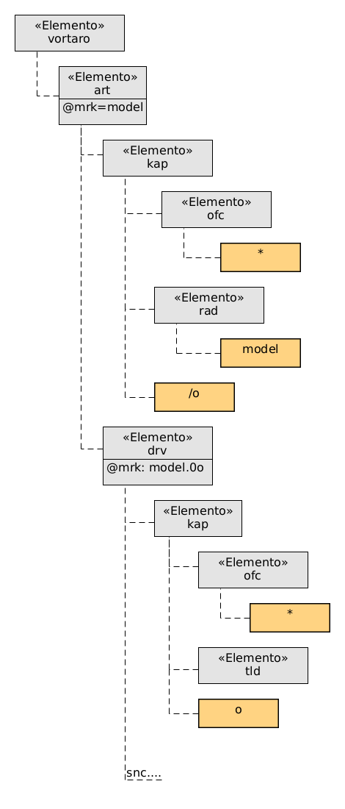

XML kaj HTML estas normoj, kiuj specifas kiel esprimi hieraĥian (arb-strukturan) dokumenton kiel linia, do unu-dimensia, teksto. Kreado de linia strukturo el hieraĥia oni nomas ankaŭ seriigi kaj la inverson malseriigi. 

Kiam oni volas trakti tian strukturon en programo oni iel devas do reformi (malseriigi) la hierarĥion legante tian tekston. La plej tradicia maniero estis, ke la analizilo dum legi la XML-tekston, ĉiam kiam ĝi renkontis elementon, atributon aŭ nurtekstan enhavon de elemento ekis iun eventon (aŭ revok-funkcion), per kiu programisto povis reagi kaj fari, kion necesis fari.

Tamen por multaj taskoj oni volas arbitre salti tien kaj reen en la hierarĥio kaj ne procedi laŭ la seria ordo en la dokumento. Tiam necesas krei reprenzentaĵon (modelon) de la tuta dokumento en la memoro de la programo. La interfacon, t.e. la aron da funkcioj, por aliri tian modelon oni normigis sub la nomo 
[DOM (Dokumenta Objekt-Modelo)](https://dom.spec.whatwg.org/#introduction-to-the-dom). La nomo eble estas iomete misgvida, ĉar ĝi fakte ne normigas la reprentadon kiel programa datumstrukturo mem, sed nur la interfacon, kiel aliri ĝin.



Realigoj de la DOM-normo ekzistas en multaj programlingvoj kiel Javoskripto, Javo, Perlo ktp. kaj eble ne ĉiuj tute strikte realigas la normon, sed iom adaptas ĝin al la stilo de la specifa programlingvo - mi ne ekspertas pri tio. Sed cetere ekzistas ankaŭ aliaj manieroj navigi en la dokumentstrukturo, plej konata estas XPath, ankaŭ normigita. Tie ĉi ni volas iom kompari plurajn manierojn navigi en la dokumentstrukturo de XML, HTML per pluraj lingvoj.


(averto: la malsupraj kodekzemploj estas ankoraŭ ne reviziitaj kja enhavas certe erarojn!)

Ni eliru de koncizigita Revo-artikolo:

```xml
<?xml version="1.0"?>
<vortaro>
  <art mrk="model">
    <kap><ofc>*</ofc> <rad>model</rad>/o</kap>
    <drv mrk="model.0o">
      <kap><ofc>*</ofc><tld/>o</kap>
      <snc mrk="model.0o.sxablono">
        <dif>
            Objekto aŭ karaktero havanta elstarajn 
            ecojn imitindajn pro perfekteco:
            <ekz>
                formi imitaĵon de donita <tld/>o.
            </ekz>
        </dif>
        <refgrp tip="sub">
            <ref cel="tip.0o">tipo</ref>,
            <ref cel="sxablo.0o">ŝablono</ref>
        </refgrp>
      </snc>
    </drv>

    <drv mrk="model.0a">
      <kap><ofc>*</ofc><tld/>a</kap>
      <snc mrk="model.0a.KOMUNE">
        <dif>
            Inda, taŭga servi kiel <tld/>o:
            <ekz>
                <tld/>a konduto.
            </ekz>
        </dif>
      </snc>
    </drv>
  </art>
</vortaro>
```

Nun ni volas eltrovi la markon kaj la kapvorton de la unua derivaĵo per diversaj lingvoj.

### Javoskripto

```javascript

// unue ni aliros la unua derivaĵon kaj ties atributo @mrk
var drv = document.getElementsByName('drv')[0];
console.log("mrk: " + drv.getAttribute('mrk'));
// nun ni ankoraŭ bezonas la tekstan enhavon de la kapvorto
var kap = drv.getElementsByName('kap')[0];
console.log("kap: " + kap.textCountent());
```

Tio redonas:

```
mrk: model.0o
kap: *o
```

Sed por la kapvorto ni fakte volas vidi `kap: modelo`. Kiel atingi tion?

- ...: nodo-tipoj
- anstatŭigo de tildo per la enhavo de `rad`

```javascript
const ELEMENT_NODE = 1;
const ATTRIBUTE_NODE = 2; 
const TEXT_NODE = 3; 

var radiko = doc.getElementsByName('rad')[0]?
    .textContent();

var kapvorto = '';
for (ido of kap.getChildren...) {
    if (ido.nodeType == TEXT_NODE) {
        kapvorto += ido.nodeValue();
    } else if (ido.nodeType == ELEMENT_NODE &&
        ido.elementName == 'tld') {
        
        kapvorto += radiko;
    }
}
```

### XPath

En la ekzemplo de Javoskripto vi vidis, ke oni devis multe tajpi por navigi la strukturarbon.
Tial la lingvoj CSS kaj XPath, kiu estas uzebla kiel modulo ene de la aliaj lingvoj, permesas tre koncize aliri specifan nodon. Jen do kiel oni adresas per CSS:

```css
drv:first-of-type[mrk]
drv:first-of-type/kap
```

Fakte, ĉar la apliko de CSS estas stilado kaj atributoj ne estas prezentataj, oni uzas ilin nur en kondicoj `[...]`, sed ne adresas rekte.

En XPath oni povas adresi ilin ankaŭ rekte, ĉar eble oni volas transformi la enhavonde atributo al enhavo de elmento per XLS ks:

```xpath
//drv[1]/@mrk
//drv[1]/kap/text()
```

Sed XPath siavice estas nur maniero esprimi la adreson de iu nodo en la strukturarbo, ĝi ne estas programlingvo. Oni bezonas do aldone programlingvo por ekzemple eltajpi, kio troviĝas ĉe la serĉata adreso.


### XSLT kun XPath

```xml
<xsl:template match="/">
    <xsl:text>mrk: </xsl:text>
    <xsl:value-of select="//drv[1]/@mrk">
    <xsl:text>
kap: </xsl:text>
    <xsl:value-of select="//drv[1]/kap/text()"/>
</xsl:template>
```

Ni vidas la saman problemon kiel en Javo-skripto: mankas la enhavo, kiun prezentas la tildo. Ni povus unue eldon la enhavon de la radiko kaj poste la enhavon de la derivaĵa kapvorto, sed ni ja ne scias certe, ĉu la tildo estas komence aŭ ie meze de la kapvorto.

Do ni devas iom dismeti la tuton kaj lasi al XSL-ŝablonoj aplikiĝi laŭ la ĝusta ordo: 

```xml
<xsl:template match="drv[1]">
    <xsl:text>mrk: </xsl:text>
    <xsl:value-of select="@mrk"/>
    <xsl:text>
kap: </xsl:text>
    <xsl:apply-templates select="tld|text()"/>
</xsl:template>

<xsl:template match="tld">
    <xsl:value-fo select="//art/kap/rad"/>
    <!-- fakte se estas nur unu, resp. la unua 'rad', kiu anstatŭigu la tildon, sufiĉus skribi //rad aŭ //rad[0] -->
</xsl:template>

```

### Prologo

En Prologo ni ne havas DOM-interfacon, kaj fakte ne bezonas, ĉar Prologo kiel simbolmanipula lingvo 
povas sufiĉe elegante labori sur strukturo de nestitaj listoj. Ĉiu XML-elemento ĉi tie estas triopo konsistanta el la elementnomo, listo de atributaj nomo-valoro-paroj kaj listo de la enhavo,
kiu povas enhavi aŭ tekstpecojn aŭ siavice elemento-triopojn.

```prolog
[element(vortaro, [], [
    element(art, [mrk='model'], [
        element(kap, [], [
            element(ofc, [], [*]), 
            ' ', 
            element(rad, [], ['model']), 
            '/o']), 
        element(drv, [mrk='model.0o'], [
            element(kap, [], [
                element(ofc, [], ['*']), 
                element(tld, [], []), 
                'o']), 
            element(snc, [mrk='model.0o.sxablono']
            %...
        ])
    ])
])]
```

Tamen trakuri profundan nestitan strukturon povas
esti iom teda, do ni havas XPath-ekvivalentajn predikatojn. 

```prolog
drv(Doc) :-
    % adresu la unuan elementon 'drv' 
    % kun la atributo 'mrk'
    xpath(Doc,//drv(1,@mrk=Mrk),Drv),
    format('mrk: ~w~n',[Mrk]),
    % adresu la elementidon 'kap' de 'drv'
    xpath(Drv,kap,Kap), kap(Doc,Kap).

kap(_,Kap) :-
    % elprenu la tutan tekstenhavon
    % de la elemento 'kap'
    xpath(Kap,/self(text),Text),
    format('kap: ~w~n',[Text]).
```

Sama problemo kiel supre, ni devas distingi tld-elementon kaj tekastan enhavon de la kapvorto por eligi ĉion bone.

```prolog
% la plibonigita difino por kap() 
kap(Doc,Kap) :-
    write('kap: '),
    xpath(Kap,/self(content),List),
    forall(
        member(Ido,List),
        once((
            % temas pri simpla teksta enhavo
            atomic(Ido), write(Ido)
            ;
            % temas pri elemento 'tld'
            Ido = element(tld,_,_),
            tld(Doc,Rad), write(Rad)
            ; 
            true % ignoru 'ofc'...
        ))
    ).

tld(Doc,Rad) :-
    xpath(Doc,//rad(text),Rad).
```


### Perlo kun DOM+XPath

Fine ankaŭ Perlo provizas realigon de DOM en XML::LibXML

...