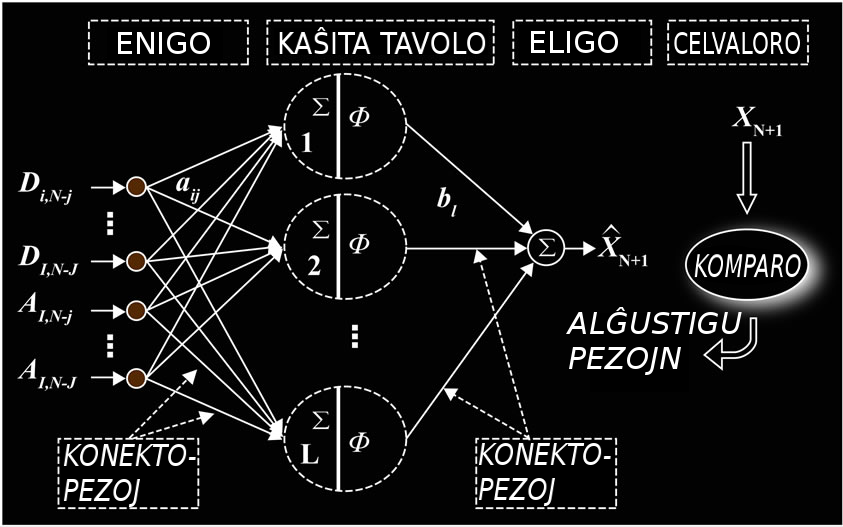
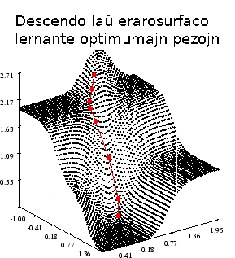
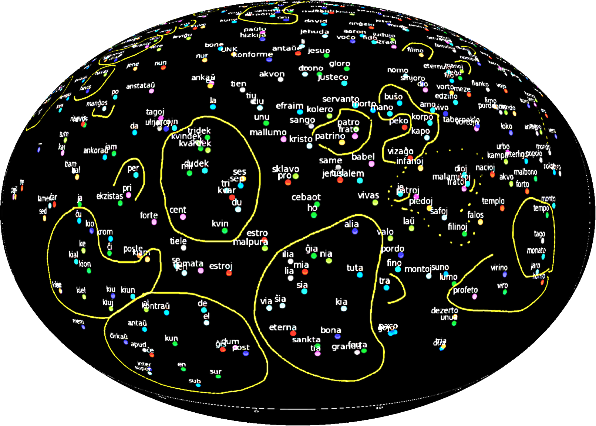

<script src="https://cdn.jsdelivr.net/npm/mermaid/dist/mermaid.min.js"></script>

# La principo de programado

Programado okazas dekomence kaj ĉiam ĝis hodiaŭ, principe, *enkele*. Tio estas, ne ĉiam en la kelo, 
nek nepre en kelmemoro, sed en-k-el-e:

<div class="mermaid">
    graph TD;
    en["en·iraj datumoj"]-->k["k·alkulado"]-->el["el·iraj datumoj"];
</div>

Oni povas distingi tri gravajn *paradigmojn* de komputila programado.

## Paradigmo 1: instrukcia 

Komputado okazas laŭ instrukcioj tradukataj al ordonoj por la
komputila procezilo. Decidoj, disbranĉiĝoj okazas origine per rektaj saltoj aŭ nuntempe per
`IF THEN ELSE`, `FOR DO WHILE`...

```assembler
.MODEL Tiny
.CONST
    HW DB "Saluton mondo!$"
.CODE
.org 100h
start:
    MOV DX, OFFSET DGROUP:HW
    MOV AH, 09H
    INT 21H
    ret
end start
```

```basic
10 PRINT "Saluton mondo!"
```

```pascal
begin
  write('Saluton mondo!');
end.
```

```lisp
(display "Saluton mondo!")
(newline)
```

```c
#include <stdio.h>
int main(void)
{
    puts("Saluton mondo!");
}
```

```bash
echo 'Saluton mondo!'
``` 

```java
class Saluton {
    public static void
        main( String[] args ) {
        System.out.print("Saluton mondo!");
    }
}
```

__Demando__: ĉu divenas la diversajn programlingvojn, en kiuj estas prezentata la mallonga programo supre?

## Paradigmo 2: deklara

Komputado okazas laŭ deklaroj, kiuj priskribas la
deziratan rezulton. Oni ne plu donas la algoritmon. Ĝi
estas enkonstruata en la lingvo.

```sql
SELECT P.Nomo, P.Familio, P.Agho, K.Kotizo, K.Monunuo
FROM Partoprenantoj P LEFT JOIN Kotizo K
WHERE K.De_Agho <= P.Agho AND P.Agho <= K.Ghis_Agho
ORDER BY P.Nomo
```

<!-- sparql -->
```
SELECT DISTINCT ?s ?t (lang(?t) as ?l)
FROM "http://purl.org/net/voko/revo#“
WHERE {
    ?s voko:kap 'hundo'@eo ;
    voko:trd ?t.
}
```

Necesas scio en formo de faktoj (ekzemple rikordoj en tabeloj) kaj reguloj. Ili nutras la
algoritmon kiu trovas la deziratan rezulton. La faktojn oni konektas per operacio [kunigo](kunigo)
per samaj (aŭ rilatigataj) valoroj.

```prolog
iu(radio,'Varsovia Vento').
iu(renkonto,'PSI').
...
moto('Varsovia Vento','bla bla bla').
...

kies_moto(Iu,Io,Moto) :-
    moto(Iu,Moto),
    iu(Io,Iu).
...

?- kies_modo(Iu,Io,'bla bla bla').
Iu = 'Varsovia Vento', 
Io = 'radio'.

```

La algoritmo estas enkonstruita en la lingvo kaj, gvidata de la
reguloj, memstare trovas la deziratan respondon. Vi nur lerte devas 
priskribi la problemon mem.

```prolog
:- use_module(library(clpfd)).
sdk(Vicoj) :- longa(9, Vicoj), % estas 9 vicoj
    maplist(longa(9), Vicoj), % ĉiu vico havas 9 fakojn
    % en ĉiuj fakoj estas unu el la ciferoj 1, 2 ... 9
    append(Vicoj, Ciferoj), Ciferoj ins 1..9,
    % ĉiuj ciferoj en vicoj kaj en kolumnoj estas diversaj
    maplist(all_distinct, Vicoj),
    transpose(Vicoj, Kolumnoj),
    maplist(all_distinct, Kolumnoj),
    % ĉiuj ciferoj de 9-fakaj kvadratoj estas diversaj
    Vicoj = [A,B,C,D,E,F,G,H,I],
    blokoj(A, B, C), blokoj(D, E, F), blokoj(G, H, I).

longa(Longa, Listo) :- length(Listo, Longa).
blokoj([], [], []).
blokoj([A,B,C|Bj1], [D,E,F|Bj2], [G,H,I|Bj3]) :-
    all_distinct([A,B,C,D,E,F,G,H,I]),
    blokoj(Bj1, Bj2, Bj3).
```

__Demando__: ĉu vi divenas kiun problemon solvas la supra kodo?


*Gramatiko* deklaras lingvo­regulojn, kiu priskribas kiel
formi aŭ disanalizi formalan lingvon.

```prolog
...
i(vi,perspron).
i(ili,perspron).
i(si,perspron).
i(ĉio,pron).
i(nenio,pron).
i(ĉie,adv).
u(ĉiu,pron).
u(kia,adj).
fi(n,_).
fu(jn,_).
fu(j,_).
fu(n,_).
vorto(i,Spc) <= i(_,Spc).
vorto(u,Spc) <= u(_,Spc).
vorto(ifi,Spc) <= i(_,Spc) / fi(_,_).
vorto(ufu,Spc) <= u(_,Spc) / fu(_,_).
```

## Paradigmo 3: lerna

Komputado okazas per *modeloj*, kiuj lernas transformi
enigon al eligo adaptante *pezojn* de statistika algoritmo.

```python
clf = Pipeline([
    ('vect', CountVectorizer(),
    ('tfidf', TfidfTransformer()),
    ('clf', MultinomialNB(alpha=0.025))
])

mb_clf=clf.fit(train_X, train_Y)

pred_lab=mb_clf.predict(test_X)
print("Test-akurateco",np.mean(pred_lab == test_Y))
```

Pezoj estas adaptitaj ekz-e laŭ gradienta
descendo ĝis minimuma devio.

  
neŭrona reto kun unu kaŝita tavolo (krom la eniga kaj eliga)



  
vortvektoroj en multdimensia spaco (projekcio) - el kunteksto lerniĝas parencaj vortoj