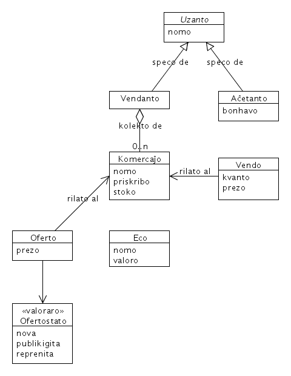

# Plani Aerkastelojn per UML

Informteĥnologiaj sistemoj kerne baziĝas sur modeloj de la realeco. La modeloj konsistas el konceptoj kaj iliaj interrilatoj. Unuigita Modelo-Lingvo (UML) evoluiĝis al universala lingvo por priskribi la strukturon kaj konduton de tiuj modeloj en formo de diagramoj. La teĥnikan realigon de modelo oni nomas sistemo.

 
Jen elekto de kelkaj UML-diagramoj je ekzemplo de bazaro montras, kiel ili helpas plani modelon.

 
## Diagramo de uzokazoj
 
  
bildo 1: Uzokazoj de bazaro
 
Uzokazoj estas la bazaj interagoj de roluloj kun la modeligata sistemo. La diagramo montras la rilatojn inter roluloj kaj uzokazoj.

*Diskuto*: Laŭ la modelo oni jam vidas, ke la modelo ne povas esti kompleta. Oni ne vidas, kio okazus post sukcesa marĉandado.
Do necesas aldoni uzokazon *aĉetanto - pagas, aĉetas* kc.
 
## Diagramo de agado

Agadodiagramoj taŭgas por priskribi unuopajn uzokazojn. Ili detalas la interagon kun la sistemo en kunteksto de uzokazo. Ili montras sinsekvon aŭ paralelecon de agoj kaj konsekvencojn de decidoj.
 
  
bildo 2: Kuro de agoj en la uzokazo aĉeti

*Diskuto*: Laŭ la desegno oni povas tuj vidi, ke eble oni forgesis konsideri la agadon de la vendanto dum la efektiva aĉeto. Tio povas esti, ke post la interkonsento la aĉetado okazas kiel memservo aŭ ni devas etendi la modelon pri la agoj de akcepto kaj kontrolo de la mono aŭ kreditkarto kaj pakado plus trandono de la varo. En ambaŭ kazoj oni iel kontrolu kaj enkasigu la ricevitan monon, ĉu ne?

 
## Diagramo de klasoj
 
  
bildo 3: Datumstrukturo de bazaro
 
Klasodiagramoj strukturas la modelon per klasoj kaj interrilatoj. Klasoj povas havi atributojn kaj metodojn. Malsupre ni koncentriĝas sur la logikan datumstrukturon de la modelo. La klasoj tie ĉi reprezentas la datumunuojn. (En la fizika datumstrukturo ili kune kun atributohavaj kaj dudimensiaj rilatoj fariĝos tabeloj.)

*Diskuto:* Vi jam devenas: la modelo iel estas ne kompleta. La aĉetanto havas sian bonhavon, sed la vendanto analoge bezonas sian kaslibron por registri detale ĉiun vendon, monricevon, repagon ktp.
 
## Diagramo de statoj
 
  
bildo 4: Statoj de komercaĵo
 
Statodiagramoj priskribas en kiuj statoj povas esti unuo (klaso) kaj kiuj transiroj eblas inter la statoj. Krome oni povas montri kondiĉojn de transiroj kaj agojn dum transiro.

*Diskuto*: surbaze de la diagramo oni povas jam trovi kaj diskuti konceptajn malfortecojn sen skribi - kaj do eble devi korekti - programkodon.
Laŭ la supra statomodelo ne eblas, konkludi ĉu ofertita varo estas en stoko. Do necesas decidi, ĉu (a) oni enkonduku regulon, ke varon oni rajtas nur oferti, kiam ĝi estas en la stoko aŭ (b) kontroli la haveblon ne per la stato-indiko sed nur per la stoko-nombro aŭ (c) uzi du sendependajn statomodelojn por la haveblo da la varo kaj la ofertado. Kiel vi plibonigus la modelon?
 
## Diagramo de kompono

Komponodiagramo montras partojn (komponentojn) de modelo kaj (inter-)uzadon de iliaj interfacoj. Komponanto estas kiel "nigra kesto" uzebla nur tra difinitiaj interfacoj. Interfaco de komponento prezentas kolekton de metodoj, per kiuj rolulo aŭ alia komponento uzas ĝin.

Ekzemple metodoj de interfaco *Aĉeti* povas esti: *montri intereson, proponi prezon, pagi monon, akcepti aĉetaĵon*.
 
  
bildo 5: Kompono de vendobudo
 
Metodojn, kiuj ŝanĝas la *staton* de la sistemo, kiuj do estas ne *nurlegaj* sed *skribaj*, oni nomas ankaŭ *transagoj*.
 
## Diagramo de sinsekvo

Sinsekvodiagramo detalas la protokolon, laŭ kiu komponentoj procedas, aŭ alivorte la protokolon de interfaco-uzado. Eblas bildigi ankaŭ, kio okazas "malantaŭ la kurteno", kiam uzanto vokas metodon de la sistemo. Oni distingas tujresponditajn (sinkronajn) kaj postresponditajn (malsinkronajn) mesaĝojn, t.e. oni ne devas atendi ĝis la rezulto sed esti preparita ricevi ĝin iam ajn..
 
  
bildo 6: Sinsekvo de procedoj dum butikumado