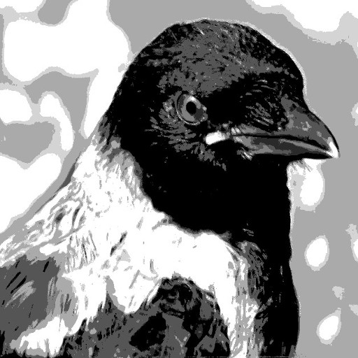

{: width="200px"}

Ni volas tie ĉi kolekti lernmaterialon pri diversaj fakoj. 
La projekto estas juna do bv. ne atendu jam multe da materialo
nek ke ĉio funkcias senmanke.

Kontribuantoj estas bonvenaj.

## Esperanto




* [{{ t.title | escape }}]({{ t.url | relative_url }})
  
  

## Programado




* [{{ t.title | escape }}]({{ t.url | relative_url }})
  


## Matematiko




* [{{ t.title | escape }}]({{ t.url | relative_url }})
  


<!-- alternativa nomo elementoj & molekuloj -->

## Kemio




* [{{ t.title | escape }}]({{ t.url | relative_url }})
  
  

<!-- alternativa nomo: (sistemo) Tero -->

## Biogeokemio




* [{{ t.title | escape }}]({{ t.url | relative_url }})
  
  

<!-- alternativa nomo: vivo | organismoj -->

## Biokemio




* [{{ t.title | escape }}]({{ t.url | relative_url }})
  
  
